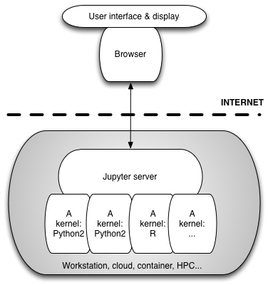
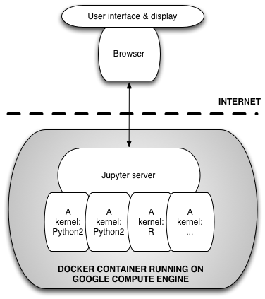

# More Jupyter: Multiple languages, the console, and caveats

## Other languages: R notebooks

Try starting an R notebook, and executing:

    require(graphics)
    (yl <- range(beaver1$temp, beaver2$temp))
    
    beaver.plot <- function(bdat, ...) {
      nam <- deparse(substitute(bdat))
      with(bdat, {
        # Hours since start of day:
        hours <- time %/% 100 + 24*(day - day[1]) + (time %% 100)/60
        plot (hours, temp, type = "l", ...,
              main = paste(nam, "body temperature"))
        abline(h = 37.5, col = "gray", lty = 2)
        is.act <- activ == 1
        points(hours[is.act], temp[is.act], col = 2, cex = .8)
      })
    }
    op <- par(mfrow = c(2, 1), mar = c(3, 3, 4, 2), mgp = 0.9 * 2:0)
     beaver.plot(beaver1, ylim = yl)
     beaver.plot(beaver2, ylim = yl)
    par(op)

Basically it all works as you'd expect...

## More magic inside notebooks
 
Commands:

    ls, cd, !, tab completion
    %lsmagic

[A list of magics](http://jupyter.cs.brynmawr.edu/hub/dblank/public/Jupyter%20Magics.ipynb)

## Import Python code

Generally it's a bad idea to write a LOT of code in a single cell; we
tend to suggest using the notebook as a way to explore data, rather than
write lots of code.  Luckily, you can import code from modules just like
you normally would.

Try entering this in a cell in a Python notebook:

    %%file mycode.py
    def f():
       print('hello, world')

and then in the following cell, enter:

    import mycode
    f()

Note, here the '%%file' is just a way of creating a file - you can do that
in a variety of ways.  Speaking of which...

## Console

Basically, you can interact with the file system in a variety of ways:
via notebook and/or running code, OR via console/upload/download/edit,
OR via terminal.

* upload files;
* download and edit files;
* save and download figures;
* terminal window;

## Where is this all running?

The general architecture of Jupyter Notebook is this:

We are running things in mybinder specifically; we'll cover this later, but:
basically we're running on Google Compute Engine.

## Caveats

* long-running notebooks don't work that well;
* multiple views of the same notebook *share the kernel* but don't share
  the output;
* this is the same on a reload...
* the execution order can be confusing: re-run your notebook from
  scratch, frequently.

[Return to index](./index.html) | Next: ['make', a workflow engine](./make-lesson.html)
